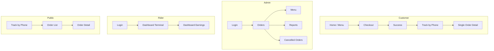
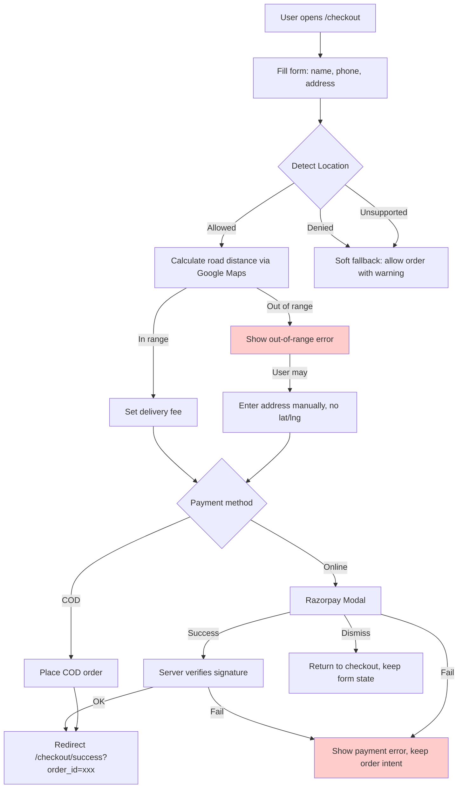
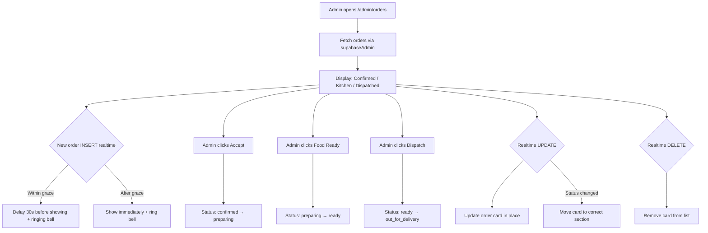
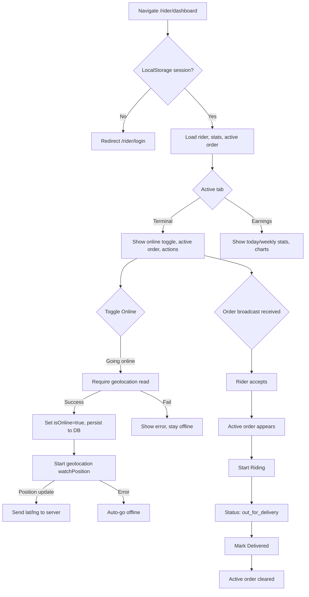
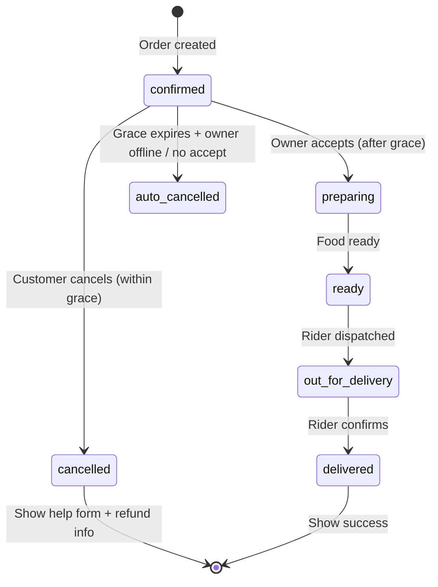
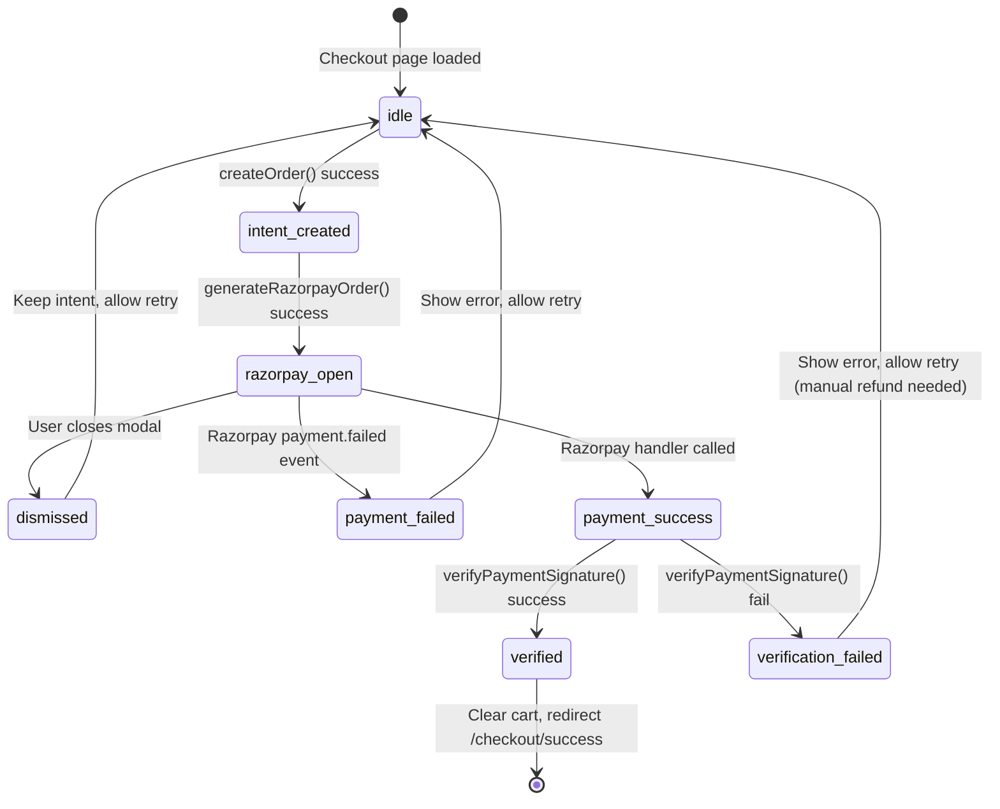
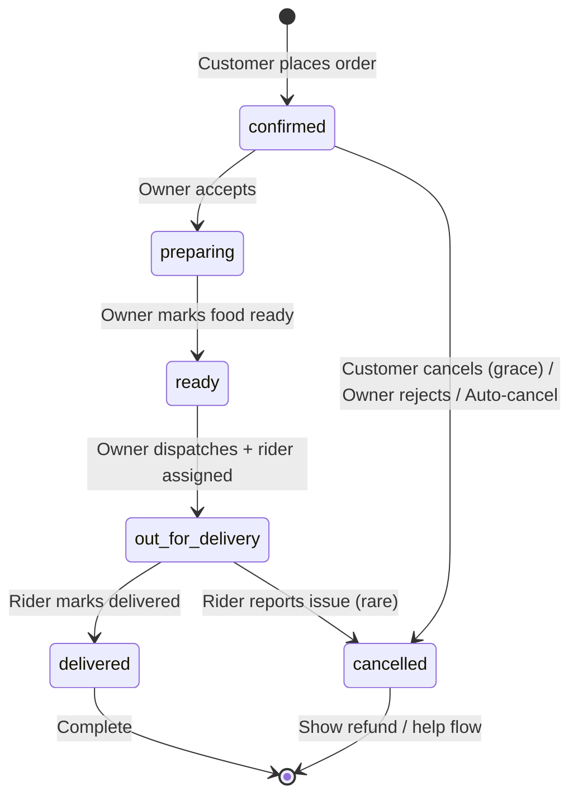

# Goodrest UI Flow Specification

> Document version: 2026-05-29  
> Purpose: Prevent navigation gaps, state sync bugs, timezone mismatches, and geolocation blockers by defining explicit flows, state machines, and screen matrices.

---

## Table of Contents

1. [Role Flow Overview](#1-role-flow-overview)
2. [Customer Flow: Home → Checkout → Success → Track](#2-customer-flow)
3. [Admin Flow: Orders → Menu → Reports → Cancelled](#3-admin-flow)
4. [Rider Flow: Login → Dashboard (Terminal / Earnings)](#4-rider-flow)
5. [Public Track Flow: Phone → List → Order Detail](#5-public-track-flow)
6. [Critical State Machines](#6-critical-state-machines)
7. [Realtime & Sync Rules](#7-realtime--sync-rules)
8. [Timezone & Data Rules](#8-timezone--data-rules)
9. [Screen Matrices (All Roles)](#9-screen-matrices)
10. [Known Bug Patterns & Guards](#10-known-bug-patterns--guards)

---

## 1. Role Flow Overview



---

## 2. Customer Flow

### 2.1 Checkout Flow



### 2.2 Checkout State Table

| State | URL | Inputs | API Calls | Error States | Next Screen |
|-------|-----|--------|-----------|--------------|-------------|
| Empty form | /checkout | name, phone, address | none | cart empty → redirect to home | Detect Location |
| Location detecting | /checkout | same + lat/lng null | `getAppSettings`, `getGoogleMapsRouteData` | geo denied, out of range, API fail | Payment selection |
| Payment ready | /checkout | all fields valid | none | Razorpay SDK missing | Razorpay / COD |
| Razorpay open | /checkout (modal) | none | `generateRazorpayOrder` | key missing, order init fail | Verification |
| Verifying | /checkout (overlay) | none | `verifyPaymentSignature` | verification fail | Success or Error |
| COD placing | /checkout (overlay) | none | `createOrder` | server fail | Success or Error |
| Success | /checkout/success?order_id=xxx | none | `getOrderById` (optional) | order not found | Track order |

### 2.3 Critical Guard: Geolocation

**Rule:** Checkout must NEVER hard-block on geolocation failure.

| Scenario | UI Behavior | Data Behavior |
|----------|-------------|---------------|
| Geo allowed, in range | Show "✅ Location Verified", enable buttons | `lat`, `lng` set, `deliveryFee` calculated |
| Geo allowed, out of range | Show "❌ Out of range", disable buttons | `lat`, `lng` null, `deliveryFee` 0 |
| Geo denied | Show "⚠️ Location unavailable. You can still order." + soft warning | `lat`, `lng` null, `deliveryFee` 45 (fallback) |
| Geo unsupported | Same as denied | Same as denied |
| Google Maps API fail | Show "✅ Location Verified (Test Mode)", enable with fallback fee | `lat`, `lng` set from device, `deliveryFee` 45 |

---

## 3. Admin Flow

### 3.1 Order Management Flow



### 3.2 Admin State Table

| Screen | URL | Data Source | Loading State | Error State |
|--------|-----|-------------|---------------|-------------|
| Orders (redirect) | /admin → /admin/orders | Server redirect | N/A | N/A |
| Orders list | /admin/orders | `getOrders` via `supabaseAdmin` | Skeleton cards | Empty state |
| Menu | /admin/menu | `getMenuItems` | Skeleton | Empty state |
| Reports | /admin/reports | `getReports` via `supabaseAdmin` | Skeleton | Empty state |
| Cancelled | /admin/cancelled-orders | `getCancelledOrders` | Skeleton | Empty state |

---

## 4. Rider Flow

### 4.1 Dashboard Lifecycle



### 4.2 Rider State Table

| Screen | URL | Auth | Data Sources | Error States |
|--------|-----|------|--------------|--------------|
| Login | /rider/login | Public | `loginRider` | Invalid phone/OTP |
| Dashboard Terminal | /rider/dashboard | `localStorage.rider_session` | `getRiderStats`, `getRiderActiveOrder`, Supabase Realtime | Geo denied, DB fail |
| Dashboard Earnings | /rider/dashboard | Same | Same + weekly chart data | Chart load fail |

---

## 5. Public Track Flow

### 5.1 Track Flow

```mermaid
graph TD
  T1[User enters phone on /track] --> T2[Fetch orders by phone]
  T2 --> T3[Show order list]
  T3 --> T4[User clicks order]
  T4 --> T5[Load /track/order/:id]

  T5 --> POLL[Poll every 5s + Realtime subscribe]
  T5 --> CANCEL{Customer cancels?}
  CANCEL -->|Within grace| CANCEL_OK[Status → cancelled]
  CANCEL -->|After grace| CALL[Show "Call restaurant"]
```

### 5.2 Track State Table

| Screen | URL | Inputs | Data | Error States |
|--------|-----|--------|------|--------------|
| Track home | /track | Phone number | `getOrdersByPhone` | No orders found |
| Track list | /track/:phone | none | Same | Same |
| Order detail | /track/order/:id | none | `getOrderById`, Realtime | Order not found (retry 5x) |

---

## 6. Critical State Machines

### 6.1 Grace Period State Machine (Order Cancellation)



**Grace Period Rules:**

| Actor | Window | Action | Guard |
|-------|--------|--------|-------|
| Customer | 0–30s after `created_at` | Cancel via UI | `status === 'confirmed' && timeLeft > 0` |
| Owner | 0–30s after `created_at` | Accept order | If not accepted, order auto-cancels |
| System | 30s after `created_at` | Auto-cancel | If `status === 'confirmed'` and owner did not accept |
| Customer | After 30s | Cancel | BLOCKED — show "Call restaurant" instead |

**Timer Sync Rules (Prevents client/server drift):**

1. Server is source of truth for `created_at`.
2. Client calculates `timeLeft` from `Date.now() - new Date(createdAt).getTime()`.
3. Timer interval: 250ms for smooth UI, but decision logic checks `timeLeft > 0`.
4. If Realtime updates status to `preparing` while timer running, immediately set `timeLeft = 0`.
5. If customer refreshes page, recalculate `timeLeft` from server `created_at` — do NOT persist timer in localStorage.

### 6.2 Payment State Machine (Online)



### 6.3 Order Lifecycle State Machine (System-wide)



**Status Transitions (Valid Matrix):**

| From | To | Who | Action | Realtime Event |
|------|----|-----|--------|----------------|
| confirmed | preparing | Owner | `acceptOrder` | UPDATE |
| confirmed | cancelled | Customer | `cancelOrder` (grace) | UPDATE |
| confirmed | cancelled | Owner | `rejectOrder` | UPDATE |
| confirmed | cancelled | System | Auto-cancel (timeout) | UPDATE |
| preparing | ready | Owner | `markFoodReady` | UPDATE |
| ready | out_for_delivery | Owner | `dispatchOrder` | UPDATE |
| out_for_delivery | delivered | Rider | `markOrderAsDeliveredRider` | UPDATE |

---

## 7. Realtime & Sync Rules

### 7.1 Channel Naming Convention

**Rule:** Every channel name MUST be globally unique per session to avoid collisions.

Format: `{context}-{entity_id}-{random_suffix}`

| Context | Channel Name | Filters | Cleanup |
|---------|--------------|---------|---------|
| Owner orders | `owner_orders_realtime_{random}` | `table: orders, event: *` | `useEffect` return |
| Rider orders | `rider-orders-{rider_id}-{random}` | `table: orders, filter: rider_id=eq.x` | `useEffect` return |
| Order tracking | `order-tracking-{order_id}-{random}` | `table: orders, filter: id=eq.x` | `useEffect` return |
| Order sync (header) | `order-sync-{order_id}-{random}` | `table: orders, filter: id=eq.x` | `useEffect` return |
| Rider location | `rider-tracking-{rider_id}-{random}` | `table: riders, filter: id=eq.x` | `useEffect` return |

### 7.2 Subscription + Polling Hybrid Pattern

**Problem:** Realtime alone can miss updates (channel flakiness, reconnects).
**Solution:** Every critical screen uses BOTH Realtime + polling fallback.

```
On mount:
  1. Fetch initial data via server action
  2. Subscribe to Realtime channel
  3. Start polling interval (e.g., 5000ms)

On Realtime event:
  1. Apply optimistic update from payload
  2. Immediately refetch full object from server to ensure consistency

On poll tick:
  1. Fetch full object
  2. If different from current state, apply update

On unmount:
  1. Remove Supabase channel
  2. Clear interval
```

**Applied in:**
- `track/order/[id]/page.tsx` (lines 59–94)
- `OrderTracker.tsx` (lines 182–209)
- `rider/dashboard/page.tsx` (lines 100–118)
- `owner/OwnerDashboardClient.tsx` (lines 51–111)

### 7.3 Grace Period Delay (Owner Dashboard)

**Rule:** New `confirmed` orders must NOT appear in owner dashboard immediately. Wait 30s grace period.

```
On INSERT of confirmed order:
  ageMs = Date.now() - new Date(created_at).getTime()
  delay = 30000 - ageMs

  if delay > 0:
    setTimeout(() => {
      Add to list + triggerBell()
    }, delay)
  else:
    Add immediately + triggerBell()
```

**Guard:** If order status changes from `confirmed` during delay, do NOT add to list.

---

## 8. Timezone & Data Rules

### 8.1 IST Timezone Handling

**Problem:** Owner reports showed stale/empty data because server (UTC) and DB (UTC) mismatched with IST expectations.

**Solution:**

| Layer | Rule |
|-------|------|
| DB Storage | All timestamps stored in UTC (`timestamptz`) |
| Server Actions | Use `supabaseAdmin` for bypassing RLS when fetching reports |
| Display | Convert to IST in client using `toLocaleString('en-IN', { timeZone: 'Asia/Kolkata' })` |
| Date Filtering | Use `startOfDay` / `endOfDay` in UTC, then convert boundaries if needed |

**Critical:** When filtering by "today" in reports, use:
```
const now = new Date();
const startOfDay = new Date(now.getFullYear(), now.getMonth(), now.getDate());
const endOfDay = new Date(now.getFullYear(), now.getMonth(), now.getDate() + 1);
// Convert to UTC ISO strings for Supabase query
```

### 8.2 Data Revalidation

| Action | Revalidation Needed |
|--------|-------------------|
| Owner accepts order | Revalidate `/admin/orders` |
| Rider marks delivered | Revalidate `/rider/dashboard`, `/track/order/:id` |
| Customer cancels | Revalidate `/track/order/:id`, `/admin/orders` |
| Menu updated | Revalidate `/`, `/admin/menu` |

---

## 9. Screen Matrices

### 9.1 Customer Screens

| Screen | URL | Client/Server | Key States | Error States |
|--------|-----|---------------|------------|--------------|
| Home | / | Server (static) | Menu loading, cart empty | Menu fetch fail |
| Checkout | /checkout | Client | Form empty, detecting location, payment ready, loading overlay | Geo blocked, Razorpay fail, verification fail |
| Success | /checkout/success | Client | Order loaded, order not found | Invalid `order_id` param |
| Track home | /track | Client | Phone input, no orders | Invalid phone, no orders |
| Track list | /track/:phone | Client | List loading, list empty | Fetch fail |
| Order detail | /track/order/:id | Client | Loading, loaded, cancelled | Order not found (poll 5x) |

### 9.2 Admin Screens

| Screen | URL | Auth | Key States | Error States |
|--------|-----|------|------------|--------------|
| Login | /admin/login | Public | Form | Invalid creds |
| Orders | /admin/orders | Cookie | Empty, list, accepting | `supabaseAdmin` fail |
| Menu | /admin/menu | Cookie | Empty, list, editing | Save fail |
| Reports | /admin/reports | Cookie | Loading, loaded, empty | Timezone mismatch (stale) |
| Cancelled | /admin/cancelled-orders | Cookie | Loading, loaded | Fetch fail |

### 9.3 Rider Screens

| Screen | URL | Auth | Key States | Error States |
|--------|-----|------|------------|--------------|
| Login | /rider/login | Public | Phone input, OTP | Invalid |
| Dashboard | /rider/dashboard | `localStorage` | Offline, online, active order, loading | Geo fail, session expired |

---

## 10. Known Bug Patterns & Guards

### 10.1 Realtime Channel Collisions

**Bug:** Multiple tabs or refreshes create duplicate channels, causing memory leaks or missed events.

**Guard:**
- Always append `Math.random().toString(36).substring(2, 10)` to channel name.
- Always call `supabase.removeChannel(channel)` in `useEffect` cleanup.
- Never use static channel names like `order-sync-{id}` without suffix.

### 10.2 Client-Server Timer Drift

**Bug:** Grace period timer calculated purely on client drifts if user refreshes or system clock changes.

**Guard:**
- Source of truth: `created_at` from server.
- Recalculate on every mount.
- Do NOT store `timeLeft` in localStorage.
- If Realtime updates status, kill timer immediately.

### 10.3 Geolocation Blocking Checkout

**Bug:** If geo fails, COD/Online buttons stay disabled, blocking order entirely.

**Guard:**
- Buttons disabled ONLY when `!formData.lat || !formData.lng`.
- Provide manual fallback: allow order with `lat/lng = null` and fallback delivery fee.
- Show soft warning, not hard block.

### 10.4 TypeScript Heavy State Mismatches

**Bug:** Heavy state objects (orders, payouts) cause TS errors when fields are added/removed.

**Guard:**
- Keep types in `src/types/` directory, versioned if needed.
- Use `toOrderRecord()` helper to normalize DB rows → app records.
- Expand types incrementally; add tests for type compliance.

### 10.5 Stale Data After Mutations

**Bug:** After owner accepts order, rider dashboard still shows old state until manual refresh.

**Guard:**
- Every mutation server action should revalidate relevant paths via `revalidatePath`.
- Realtime channels must listen for `UPDATE` events, not just `INSERT`.
- Polling fallback (5s) catches any missed Realtime events.

---

## Appendix A: File Index

| Flow | Key Files |
|------|-----------|
| Checkout | `src/app/checkout/page.tsx`, `src/components/CheckoutForm.tsx` |
| Track | `src/app/track/order/[id]/page.tsx`, `src/components/OrderTracker.tsx` |
| Admin | `src/app/admin/orders/page.tsx`, `src/components/owner/OwnerDashboardClient.tsx` |
| Rider | `src/app/rider/dashboard/page.tsx`, `src/components/rider/TerminalView.tsx`, `src/components/rider/EarningsView.tsx` |
| Actions | `src/app/actions/orderActions.ts`, `src/app/actions/ownerActions.ts`, `src/app/actions/riderActions.ts` |
| Types | `src/types/orders.ts`, `src/types/payment.ts` |

---

## Appendix B: Action Items

- [ ] Add `revalidatePath` to all mutation server actions.
- [ ] Audit all `supabase.channel()` calls for unique naming.
- [ ] Verify `Date.now()` vs server `created_at` in all timers.
- [ ] Add E2E test: geo denied → COD button still enabled.
- [ ] Add unit test: grace period auto-cancel at 30s.
- [ ] Document IST conversion logic in `reportActions.ts`.
